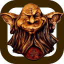
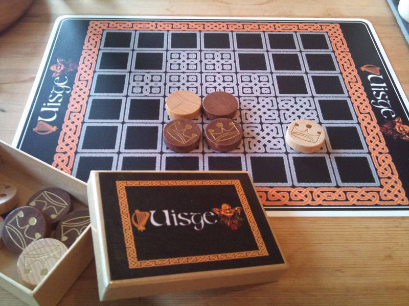
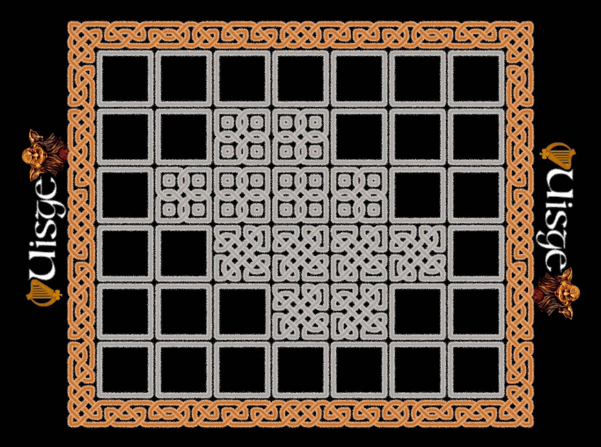

Uisge
====================

Uisge - 2 player abstract strategic perfect information
board game claiming to have Irish, Celtic or Gaelic origins from 12th century.

Abstract
--------------------

__Keywords, Categories__ _2-player board game, deterministic game with perfect information_

Rules
--------------------

- [The rules of the board game Uisge in English language](https://omerkel.github.io/Uisge/html5/src/uisge_rules-en.html)
- [Die Spielregeln vom Brettspiel Uisge in deutscher Sprache](https://omerkel.github.io/Uisge/html5/src/uisge_rules-de.html) (The rules of the board game Uisge in German language)

Play Online
--------------------

- [Play in your browser](https://omerkel.github.io/Uisge/javascript/html5/src/)

Print-and-Play
--------------------

Links
--------------------

- [Uisge on BoardGameGeek](https://boardgamegeek.com/boardgame/11421/uisge)

Contributors / Authors
--------------------

Please see [AUTHORS](AUTHORS) for the maintained contributor list.

_All logos, brands and trademarks mentioned belong to their respective owners._
