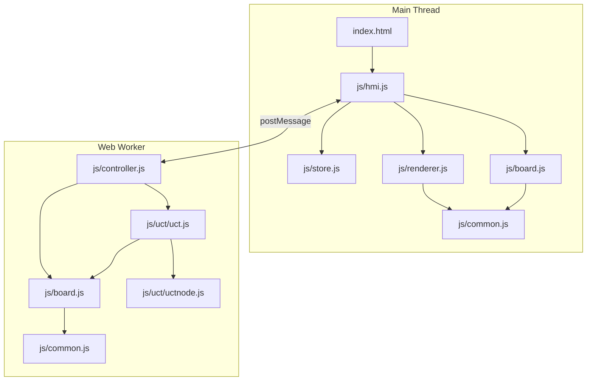
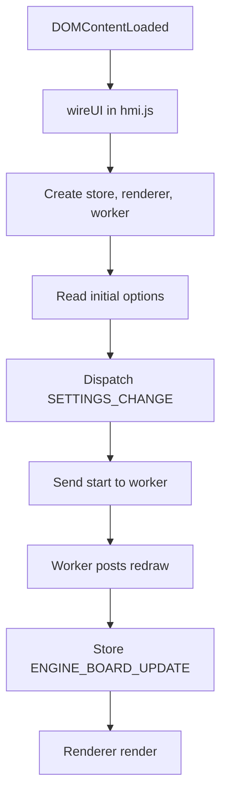
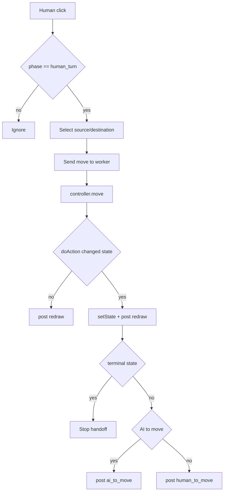
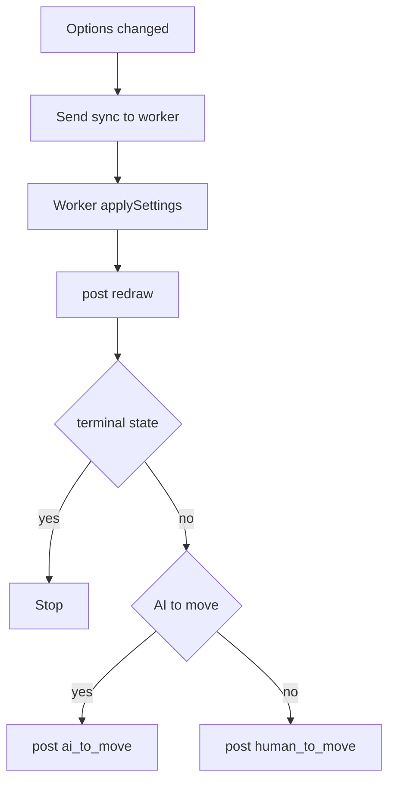
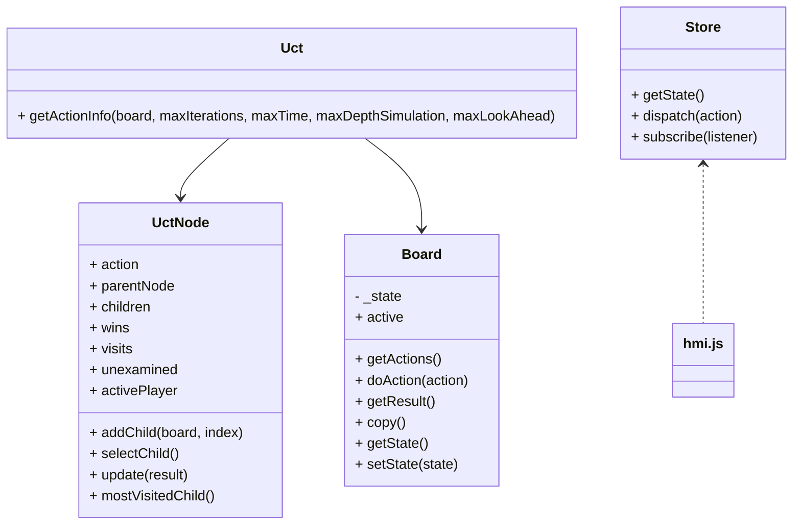
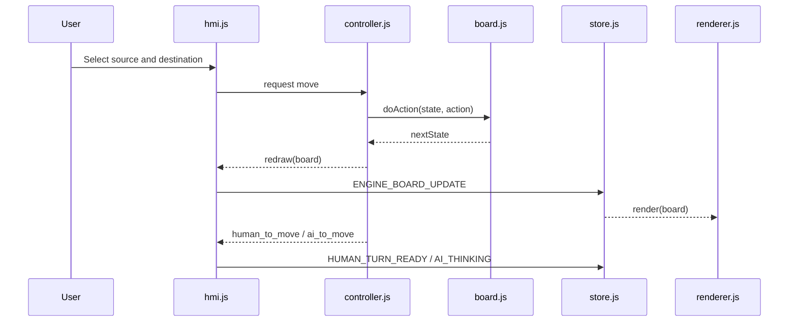

# Software Architecture - Uisge

> Copyright (c) 2016, 2026 Oliver Merkel. MIT License.

## 1. Overview

Uisge is a browser-only single-page application implemented with vanilla ES modules.
The design separates rendering/UI concerns from game-state/AI concerns:

- Main thread: DOM, SVG rendering, options/navigation UI
- Worker thread: authoritative game state, move validation, UCT/MCTS AI
- Pure game logic module for deterministic unit testing

For UCT details, see [engine_mcts_ucb.md](engine_mcts_ucb.md).

## 2. Dependency Diagram



## 3. Flow Charts

### 3.1 Startup



### 3.2 Move And Turn Handoff



### 3.3 Settings Sync



## 4. Class Diagram



## 5. Interfaces

### 5.1 Board And Action Data

```ts
type Player = 0 | 1;
type Piece = 0 | 1 | 2 | 3 | 4;

interface CellRef {
  row: number;
  column: number;
}

interface Action {
  from: CellRef;
  to: CellRef;
  type: 'jump' | 'move';
}

interface LatestMove extends Action {
  player: Player;
}

interface BoardState {
  active: Player;
  grid: Piece[][]; // 6x7
  winner: Player | null;
  isDraw: boolean;
  latestMove: LatestMove | null;
  winningLine: CellRef[] | null;
}
```

### 5.2 Worker Messaging

```ts
interface WorkerSettingsPayload {
  playersouth: 'Human' | 'AI';
  playernorth: 'Human' | 'AI';
  difficultysouth: 'Easy' | 'Medium' | 'Hard';
  difficultynorth: 'Easy' | 'Medium' | 'Hard';
  deviceprofile: 'Auto' | 'Desktop' | 'Mobile';
  selectionmode: 'MustMove' | 'Flexible';
  resolveddeviceprofile: 'Desktop' | 'Mobile';
}

interface WorkerRequestMessage {
  class: 'request';
  request: 'start' | 'restart' | 'move' | 'action_by_ai' | 'sync';
  settings: WorkerSettingsPayload;
  action?: Action;
}

interface WorkerEventMessage {
  eventClass: 'request';
  request: 'redraw' | 'human_to_move' | 'ai_to_move';
  board: BoardState;
}
```

### 5.3 Renderer Interface

```ts
interface Renderer {
  render(boardState: BoardState, selectableActions?: Action[], selectedFrom?: CellRef | null, allowReselect?: boolean): void;
  resize(): void;
  actionKey(action: Action): string;
}
```

## 6. Module Responsibilities

### js/common.js

- Board constants (`ROWS`, `COLUMNS`, piece IDs)
- Player constants
- Shared action key helper `actionToKey(action)`

### js/board.js

- Pure rules, legal move generation, and state transitions
- Orthogonal global connectivity invariant
- Terminal detection (all-kings win or no-reply win)
- `Board` adapter for UCT simulation

### js/controller.js

- Web Worker orchestrator and single writer of board state
- AI budget selection by side, difficulty, device profile, and phase
- Request handling for `start`, `restart`, `move`, `action_by_ai`, `sync`
- Turn handoff events after valid moves and after `sync`

### js/hmi.js

- Composition root (store + renderer + worker)
- Options reading and synchronization to worker
- Worker event mapping into reducer actions
- AI handoff pause (`AI_MOVE_PAUSE_MS = 900`)
- Debounced resize auto-profile re-sync in Auto mode

### js/renderer.js

- SVG scene and overlays
- Layout constants include:
  - `GRID_CENTER_OFFSET_Y` for board-art alignment
  - `CROWN_CENTER_OFFSET_Y` for crown centering
- Visual states: selectable border, selected border/glow, destination ring, latest source marker, crown overlay

### js/store.js

- Minimal Redux-like store
- Pure reducer (`appReducer`) with app view/phase/board/settings state

## 7. Threading Model

- Main thread handles input and rendering only.
- Worker thread handles state mutation and AI compute.
- Main thread never mutates board state directly; it consumes worker snapshots.

## 8. Testing

- Unit tests (`tests/unit/*.test.js`): board rules, UCT, store, common helper
- E2E tests (`tests/e2e/game.spec.js`): navigation/options/interaction/regressions/accessibility
- Coverage thresholds enforced in `vitest.config.js` at 98% for statements/branches/functions/lines

## 9. Sequence Diagram


